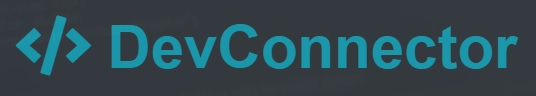
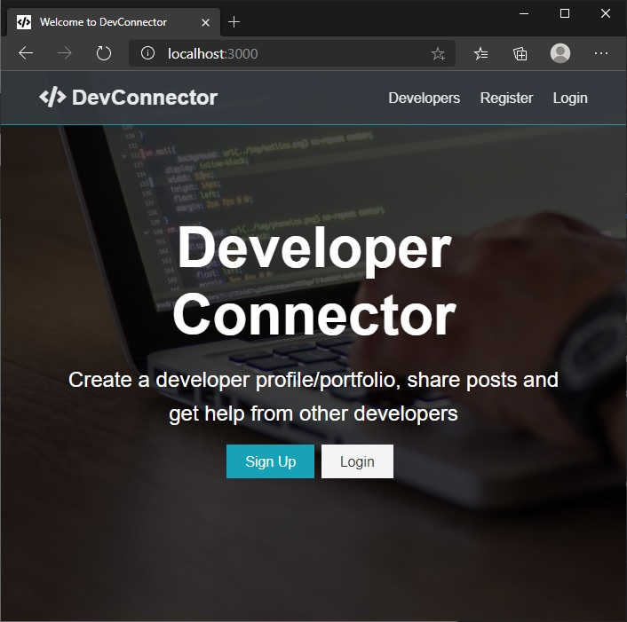
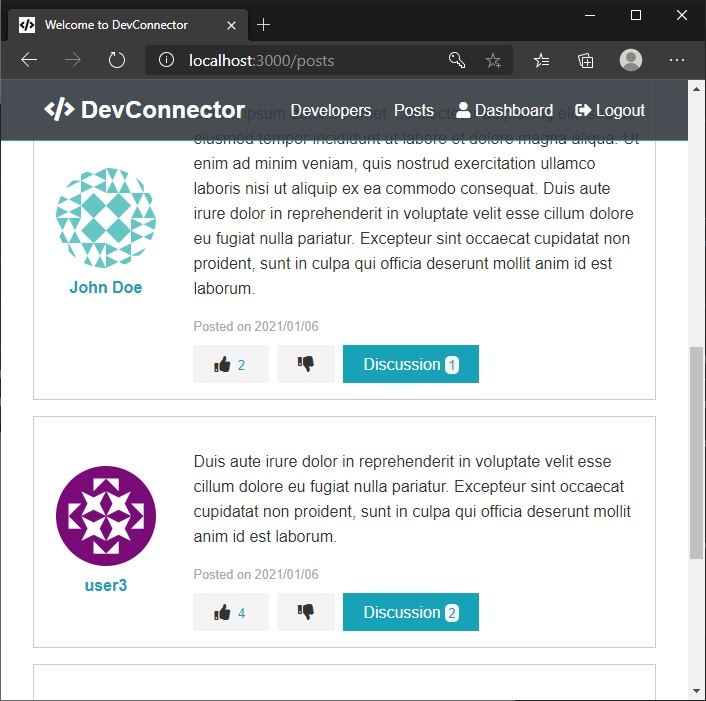
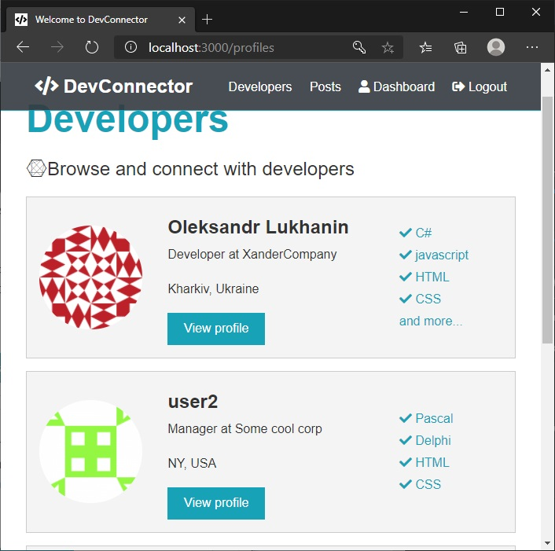
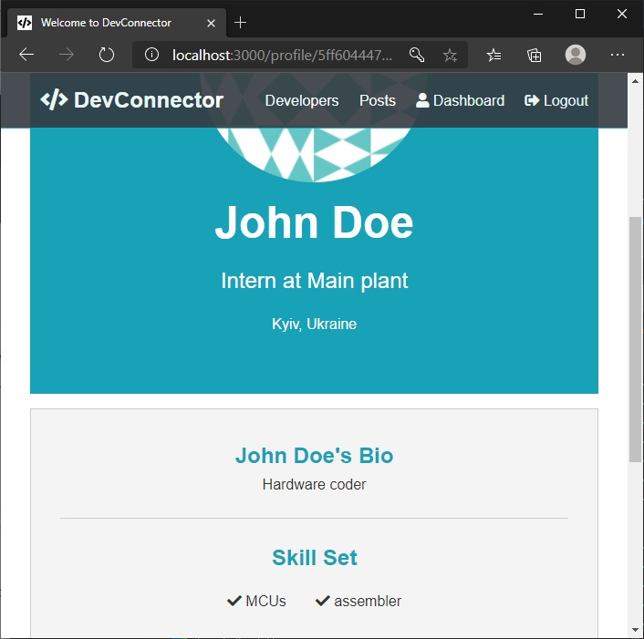

<p align="center">
  <a href="https://devconnect-chen.herokuapp.com" target="blank"></a>
</p>

# Description

This is a MERN stack application, a small social network app that includes authentication, profiles and forum posts. Authenticated users can make posts, comment posts, like posts; edit their experience, education etc

<p align="center">
  
   
  
  

</p>

## Live demo

Live demo of the app is hosted on Heroku.  
Visit [https://devconnect-chen.herokuapp.com](https://devconnect-chen.herokuapp.com)

Test user credentials:

> login - _user2@mail.com_  
> password - _123456_

_Due to demo reasons and heroku free terms, if an app receives no web traffic in a 30-minute period, it will sleep. Therefore, during the first launch, the application may take longer to load than usual, approximately 15 - 20 seconds. So please be patient and wait for the app to launch. Subsequent launches will be relatively fast._

## Technology stack

> ### FrontEnd
>
> - React
> - React Hooks
> - Redux with HOCs
> - React router
>
> ### BackEnd
>
> - Node
> - Express
> - JWT
> - MongoDB
> - Heroku hosting
>   <br>

# Usage


<br>

Open cloned project in your editor and install server and client dependencies:

```Shell
npm i
cd client
npm i
```

<br>

### Add a _default.json_ file in config folder with the following

```
{
  "mongoURI": "<your_mongoDB_Atlas_uri_with_credentials>",
  "jwtSecret": "secret",
  "githubToken": "<yoursecrectaccesstoken>"
}
```
<br>
<br>

### Run Server

```bash
npm run dev     # Express & React :3000 & :5000
npm run server  # Express API Only :5000
npm run client  # React Client Only :3000
```
